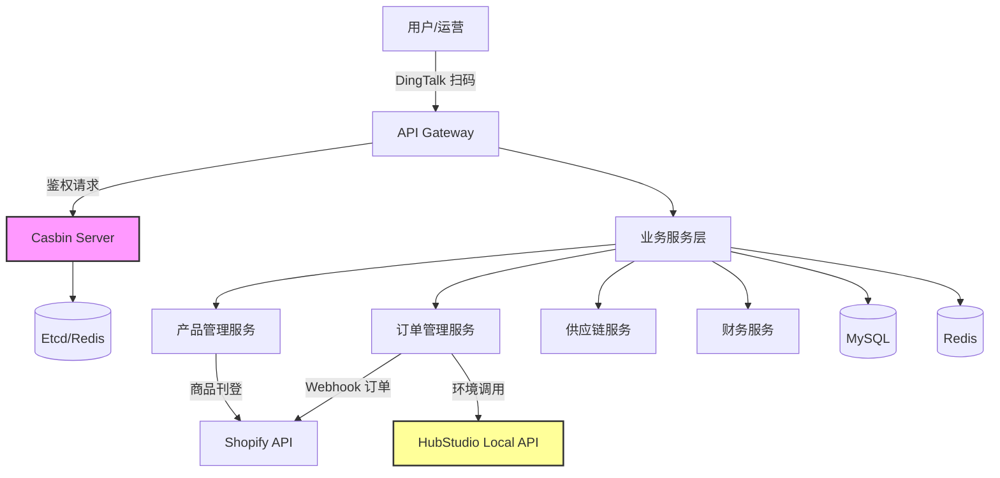
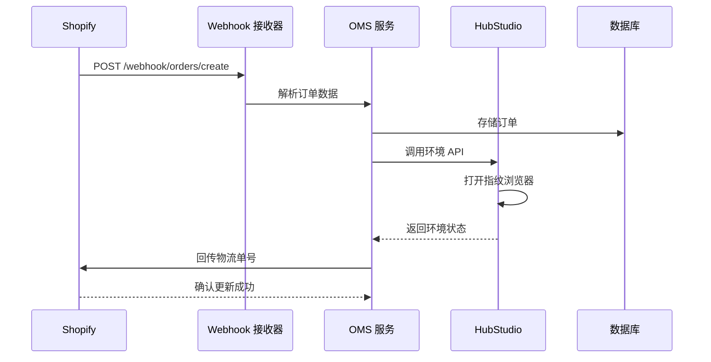

# 跨境电商业务中台 PRD
> **项目代号**: BIOU DATA CENTER | **英文名称**: E-commerce Middle Platform (EMP)

| 文档属性 | 内容 |
| :--- | :--- |
| **项目名称** | 跨境电商业务中台 (EMP) |
| **文档版本** | V1.1 (Ready for Review) |
| **撰写日期** | 2025-12-08 |
| **文档状态** | 已完善 - 待最终评审 |
| **面向对象** | 开发团队、架构师、产品经理 |

### 版本变更记录

| 版本 | 日期 | 修订人 | 主要变更内容 |
| :--- | :--- | :--- | :--- |
| V1.0 | 2025-12-08 | 产品团队 | 初稿创建，完成核心功能规划 |
| V1.1 | 2025-12-08 | 技术团队 | 新增架构图、数据模型、成功指标、异常处理、风险评估、术语表 |

---

## 1. 项目背景与目标
**背景**：
当前跨境电商业务面临多店铺管理复杂（Shopify）、环境隔离要求高（HubStudio 防关联）、供应链与财务数据割裂等痛点。现有操作依赖人工跨系统切换，效率低且存在账号安全风险。

**核心目标**：
1.  **统一入口**：集成 DingTalk 扫码登录，一站式管理所有业务。
2.  **权限中台化**：基于 **Casbin Server** 构建中心化鉴权，实现细粒度的 RBAC 权限控制。
3.  **安全环境隔离**：深度集成 HubStudio API，通过中台调度指纹浏览器，保障店铺账号安全。
4.  **数据闭环**：打通 "采购 -> 刊登 -> 订单 -> 物流 -> 财务" 全链路数据流。

---

## 2. 总体技术架构 (Architecture)

### 2.1 技术选型
*   **前端 (Frontend)**: Vue.js / React (Ant Design Pro)
*   **后端业务 (Backend)**: Python (FastAPI/Django) 或 Java (Spring Boot)
*   **权限中心 (Auth)**: **Casbin Server (Go/Rust)** - 独立部署，提供 gRPC 鉴权服务。
*   **数据库 (DB)**: MySQL (业务数据) + Redis (缓存/会话) + Etcd/Redis (Casbin 策略同步)。

### 2.2 系统架构图

### 2.3 数据流转示例：订单处理流程

### 2.4 关键集成
*   **DingTalk API**: 身份认证、组织架构同步。
*   **Shopify API**: 商品刊登、订单同步、物流回传。
*   **HubStudio Local API**: 唤起本地环境、环境状态监控。

---

## 3. 用户角色 (User Roles)

| 角色 | 职责描述 | 核心权限示例 |
| :--- | :--- | :--- |
| **超级管理员** | 系统整体配置、策略管理 | `*` (All Permissions) |
| **运营人员** | 产品开发、上架、店铺维护 | `p, role:ops, /api/product, write` |
| **供应链/采购** | 采购下单、供应商管理 | `p, role:purchase, /api/supply, write` |
| **物流专员** | 运单配对、发货操作 | `p, role:logistics, /api/shipping, write` |
| **财务人员** | 成本录入、利润核算 | `p, role:finance, /api/report, read` |

---

## 4. 功能模块详解 (Functional Requirements)

### 4.1 🔐 身份认证与权限管理 (Auth & IAM - Casbin Enhanced)
> **架构策略**：认证 (Authentication) 与 鉴权 (Authorization) 分离。DingTalk 负责认证，Casbin 负责鉴权。

| 功能点 | 详细需求描述 | 优先级 |
| :--- | :--- | :--- |
| **DingTalk 扫码登录** | 1. 集成 DingTalk 扫码/免登。 2. **自动注册/白名单**：登录时校验用户是否在企业白名单/部门内。是则自动创建账号并关联钉钉 ID，否则拒绝。 | P0 |
| **Casbin 策略管理** | **可视化权限配置台**： 1. 管理角色 (Role) 与用户 (User) 的继承关系 (g)。 2. 配置访问策略 (p)：`Subject, Object, Action`。 3. 支持策略热加载 (Watcher 机制)，修改即生效。 | P0 |
| **权限中间件 (Middleware)** | 在 API Gateway 或业务层拦截请求，提取 `sub (user/role)`, `obj (url)`, `act (method)`，调用 Casbin Server `Enforce` 接口进行鉴权。 | P0 |
| **HubStudio 账号绑定** | 每个中台账号需强制绑定唯一的 HubStudio Team ID / User ID，用于后续环境调用鉴权与日志溯源。 | P1 |
| **安全审计** | 1. **操作日志**：记录 Who, When, What (Diff), IP。 2. **页面水印**：全屏显示“姓名+工号”斜纹水印，防止截图泄密。 | P1 |

### 4.2 📦 产品库系统 (PIM)
> **目标**：实现“一次编辑，多端适配，一键刊登”。

| 功能点 | 详细需求描述 | 优先级 |
| :--- | :--- | :--- |
| **产品资料管理 (CRUD)** | 字段包含：SPU/SKU、中英文名、采购链接、参考竞品 URL、多图管理、预设分类。 | P0 |
| **详情页模板引擎** | 1. **JSON 模板库**：存储 Shopify Section/Block 结构的 JSON 片段。 2. **智能匹配**：根据目标店铺/平台，自动组装对应的 JSON 模板。 3. **版本管理**：记录详情页版本号 (v1.0, v2.0)，支持一键回滚。 | P0 |
| **一键刊登 (Listing)** | 流程：选择产品 -> 勾选店铺 (支持多选) -> 渲染模板 -> 调用 Shopify API 推送 -> 返回 Shopify Product ID。 | P0 (MVP) |
| **数据导入导出** | 支持通用 CSV 导入产品池；支持导出适配 Shopify 格式的 CSV 包。 | P1 |

### 4.3 🚚 订单与物流系统 (OMS)
> **目标**：自动化订单处理，兼顾高风险店铺的环境安全。

| 功能点 | 详细需求描述 | 优先级 |
| :--- | :--- | :--- |
| **订单同步 (Sync)** | 配置 Shopify Webhook (`orders/create`, `orders/updated`)，实时将订单落库至中台。 | P0 |
| **运单管理** | 运单列表展示，支持手动输入或批量导入物流单号，与 Shopify 订单号绑定。 | P0 |
| **HubStudio 物流回传** | **混合回传模式**： 1. **API 直连**：普通店铺直接调用 Shopify Fulfillment API。 2. **环境安全模式 (重点)**：针对风控店铺，中台调用 HubStudio API 唤起指纹浏览器 -> 脚本/人工介入回传 -> 避免服务器 IP 关联。 | P0 |
| **测试闭环** | 提供“创建测试订单”按钮，模拟从下单到抓取、再到回传的全流程，用于系统自检。 | P1 |

### 4.4 🏭 供应链与采购系统 (SCM)
> **目标**：规范采购动作，沉淀成本数据。

| 功能点 | 详细需求描述 | 优先级 |
| :--- | :--- | :--- |
| **采购需求池** | 系统根据订单缺货情况或安全库存预警，自动生成建议采购清单。 | P1 |
| **采购流程管理** | 状态机：`草稿` -> `审批中` (Casbin控制权限) -> `已下单` -> `部分入库` -> `完成`。 | P1 |
| **合同与模版** | 内置采购合同模板，支持填充变量（供应商、金额、日期）生成 PDF。 | P2 |

### 4.5 🖥️ Hub 环境管理系统
> **目标**：无需切换软件，在中台直接控制浏览器。

| 功能点 | 详细需求描述 | 优先级 |
| :--- | :--- | :--- |
| **环境列表同步** | 拉取 HubStudio 环境数据（ID、名称、备注、代理状态）。 | P1 |
| **一键启动** | 点击“启动”，调用 Local API 打开对应的指纹浏览器窗口。 | P1 |
| **API 状态监控** | 监控 HubStudio 插件/服务连接状态，异常报警。 | P2 |

#### 4.5.1 HubStudio 集成风险与对策

> [!WARNING]
> HubStudio 是本地 API，存在稳定性和可用性风险

| 风险项 | 影响 | 缓解措施 |
| :--- | :--- | :--- |
| **API 限流** | 高频调用可能被限制 | 1. 实施请求队列 2. 错峰调用策略 3. 缓存环境列表（5分钟） |
| **本地服务离线** | 员工电脑关机/网络断开导致无法调用 | 1. 要求关键岗位保持在线 2. 设置专用服务器作为备用节点 |
| **版本兼容性** | HubStudio 更新可能破坏 API | 1. 锁定测试版本 2. 建立版本升级测试流程 |
| **环境不存在** | API 返回 404 | 1. 定期同步环境列表（每小时） 2. 删除前二次确认 |

**降级方案**：
- 当 HubStudio 不可用时，系统提示人工回传 + 记录待处理队列
- 非风控店铺优先使用 API 直连模式

### 4.6 📢 广告与媒体库 (Ads & DAM)
| 功能点 | 详细需求描述 | 优先级 |
| :--- | :--- | :--- |
| **媒体资源库** | 集中存储图片、视频素材，支持标签化管理（用于广告和详情页）。 | P1 |
| **像素助手** | 一键生成/安装 Facebook/TikTok Pixel 代码。 | P2 |
| **API 数据接入** | 对接 FB Marketing API，拉取广告花费数据（用于财务计算）。 | P2 |

### 4.7 💰 财务管理系统 (Finance)
| 功能点 | 详细需求描述 | 优先级 |
| :--- | :--- | :--- |
| **利润报表** | 维度：按店铺、按 SKU、按日期。 公式：`销售额 - 采购成本 - 头程/尾程运费 - 广告费 - 平台佣金 = 毛利`。 | P1 |

---

## 5. 非功能性需求 (NFR)

1.  **性能**：
    *   Casbin 鉴权响应时间 < 20ms。
    *   Webhook 订单同步处理延迟 < 5s。
    *   API P99 响应时间 < 500ms。
2.  **安全性**：
    *   API 接口全量鉴权。
    *   敏感配置（Shopify Token, Hub API Key）加密存储。
    *   内网穿透/IP 白名单访问限制。

### 5.1 安全增强措施

| 安全领域 | 具体措施 |
| :--- | :--- |
| **数据加密** | - Shopify Token/API Key 使用 AES-256 加密存储 - 数据库连接使用 SSL/TLS - 敏感字段（成本、利润）列级加密 |
| **API 安全** | - 所有接口强制 HTTPS - 实施 Rate Limiting (100 req/min/user) - API Key 定期轮换机制（每 90 天） |
| **审计与监控** | - 所有敏感操作记录审计日志（保留 180 天） - 异常登录地点/时间告警 - Casbin 策略变更需要双人审批 |
| **备份与恢复** | - 数据库每日全量备份 + 实时 binlog - RTO < 4h, RPO < 1h - 每季度演练恢复流程 |

3.  **兼容性**：
    *   核心流程适配主流浏览器（Chrome/Edge）。
    *   移动端（H5）适配核心审批与报表查看。

---

## 6. MVP (最小可行性产品) 实施路线图

**Phase 1: 核心链路打通 (预计周期: 4-6周)**
1.  **基建**：部署 Casbin Server，完成 DingTalk 扫码登录与基础 RBAC 配置。
2.  **商品**：完成产品库 CRUD，实现 JSON 模板化的一键刊登。
3.  **订单**：跑通 Shopify Webhook 抓单，实现 HubStudio 环境下的运单回传。

**Phase 2: 业务闭环与提效 (预计周期: 4周)**
1.  **采购**：上线采购流程与合同管理。
2.  **财务**：上线基础利润报表。
3.  **安全**：完善日志审计与水印系统。

---

## 7. 成功指标与验收标准

### 7.1 业务指标 (Business Metrics)
- **效率提升**：操作人员平均刊登时间从 30分钟/产品 降至 5分钟/产品（提升 83%）
- **错误率下降**：订单处理错误率从 5% 降至 1% 以下
- **系统使用率**：DAU (日活跃用户) 达到团队总人数的 80%
- **账号安全**：零店铺关联封号事件

### 7.2 技术指标 (Technical Metrics)
- **系统可用性**：SLA ≥ 99.5%
- **API 响应时间**：P99 < 500ms
- **权限验证延迟**：< 20ms
- **订单处理延迟**：Webhook 接收到入库 < 5s

### 7.3 MVP 验收标准
- [ ] 支持至少 3 个 Shopify 店铺的集中管理
- [ ] 成功完成 100 个订单的全流程闭环测试
- [ ] 所有 P0 功能通过用户验收测试 (UAT)
- [ ] 核心权限策略覆盖率达到 100%
- [ ] 完成安全审计和渗透测试

---

## 8. 异常场景处理

### 8.1 Shopify API 异常

| 场景 | 处理策略 |
| :--- | :--- |
| **Rate Limit (429)** | 指数退避重试，最多重试 3 次，失败后加入延迟队列（下次整点重试） |
| **订单已存在 (重复 Webhook)** | 使用 Shopify Order ID 做幂等性校验，重复订单直接忽略 |
| **刊登失败 (Product 创建失败)** | 记录错误日志，标记产品状态为"刊登失败"，支持手动重试 |
| **Token 过期/无效** | 自动告警通知管理员重新授权，临时冻结该店铺操作 |

### 8.2 权限异常

| 场景 | 处理策略 |
| :--- | :--- |
| **用户不在白名单** | 登录时拒绝并显示"请联系管理员开通权限" |
| **Casbin Server 不可用** | 降级至本地缓存策略（仅允许读操作），告警通知运维 |
| **权限变更未同步** | 强制用户重新登录，刷新 Token 和权限缓存 |
| **越权访问尝试** | 记录审计日志，连续 3 次触发账号锁定 30 分钟 |

---

## 9. 风险评估与缓解策略

> [!IMPORTANT]
> 本章节识别了项目实施过程中的关键风险，并提供了相应的缓解措施

### 9.1 风险评估矩阵

| 风险编号 | 风险描述 | 可能性 | 影响 | 优先级 | 缓解措施 |
| :--- | :--- | :--- | :--- | :--- | :--- |
| R-001 | Casbin 权限设计复杂度超预期 | 中 | 高 | **P0** | 1. Phase 1 仅实现基础 RBAC 2. 引入 Casbin 专家咨询 3. 提前进行 POC 验证 |
| R-002 | HubStudio API 不稳定或限流 | 高 | 高 | **P0** | 1. 实施请求队列和限流保护 2. 建立降级方案（手动操作） 3. 与 HubStudio 厂商沟通 SLA |
| R-003 | Shopify API 频繁变更 | 中 | 中 | **P1** | 1. 订阅 Shopify 开发者更新通知 2. 使用稳定版本 API 3. 建立 API 版本兼容层 |
| R-004 | 店铺关联导致封号 | 低 | 极高 | **P0** | 1. 严格隔离环境（HubStudio） 2. 定期审计操作日志 3. 制定应急预案 |
| R-005 | 团队对新技术栈不熟悉 | 中 | 中 | **P1** | 1. 提前技术培训 2. 引入技术顾问 3. 建立知识库和最佳实践文档 |
| R-006 | 数据迁移和同步问题 | 中 | 高 | **P1** | 1. 制定详细迁移计划 2. 分批次灰度迁移 3. 保留旧系统作为备份 |
| R-007 | 第三方依赖服务中断 | 低 | 高 | **P1** | 1. 选择高可用服务商 2. 建立服务降级机制 3. 多云备份方案 |

### 9.2 技术风险

#### 9.2.1 权限系统复杂度风险
**风险描述**：Casbin 配置复杂，策略编写错误可能导致权限漏洞或业务阻塞。

**缓解措施**：
- [ ] MVP 阶段仅实现基础的角色-资源-操作映射
- [ ] 建立权限配置的测试用例覆盖（100%核心路径）
- [ ] 策略变更实施双人审核制度
- [ ] 提供可视化的权限配置工具，降低配置难度

#### 9.2.2 系统性能瓶颈
**风险描述**：高并发场景下（如大促期间订单激增），系统响应缓慢或崩溃。

**缓解措施**：
- [ ] 提前进行压力测试（模拟 1000 订单/小时）
- [ ] 实施 Redis 缓存热点数据（商品、店铺配置）
- [ ] API 网关实施限流和熔断机制
- [ ] 准备弹性扩容方案（Docker/K8s）

### 9.3 业务风险

#### 9.3.1 用户接受度低
**风险描述**：团队习惯现有工具，对新中台抗拒，导致使用率低。

**缓解措施**：
- [ ] 上线前充分的用户培训（录制视频教程）
- [ ] 设计简洁直观的 UI/UX
- [ ] 分阶段推广：先试点核心用户，再全员推广
- [ ] 收集反馈快速迭代优化

#### 9.3.2 业务需求频繁变更
**风险描述**：跨境电商政策、平台规则变化快，需求频繁调整。

**缓解措施**：
- [ ] 架构设计保持灵活性（低耦合、高内聚）
- [ ] 建立快速响应机制（周迭代）
- [ ] 核心功能模块化，便于替换
- [ ] 预留配置化能力，减少硬编码

### 9.4 集成风险

#### 9.4.1 Shopify Webhook 丢失或重复
**风险描述**：网络问题导致 Webhook 未接收，或重复推送导致订单重复处理。

**缓解措施**：
- [ ] 实施幂等性校验（基于 Shopify Order ID）
- [ ] 建立定时轮询补偿机制（每小时对比订单）
- [ ] 记录所有 Webhook 请求日志，便于排查
- [ ] 设置告警：超过 5 分钟未收到订单触发通知

#### 9.4.2 HubStudio 环境同步延迟
**风险描述**：环境信息更新不及时，导致调用失败。

**缓解措施**：
- [ ] 实施增量同步机制（监听 HubStudio 事件）
- [ ] 调用前实时验证环境状态
- [ ] 提供手动刷新按钮
- [ ] 缓存环境列表（TTL=5分钟）

### 9.5 安全风险

#### 9.5.1 敏感数据泄露
**风险描述**：Shopify Token、采购成本等敏感数据被非法访问。

**缓解措施**：
- [ ] 所有敏感字段使用 AES-256 加密存储
- [ ] 数据库访问实施 IP 白名单
- [ ] 页面水印 + 操作审计日志
- [ ] 定期进行安全扫描和渗透测试

#### 9.5.2 越权操作
**风险描述**：用户绕过权限控制，访问或修改无权限的数据。

**缓解措施**：
- [ ] 前后端双重权限校验
- [ ] 敏感操作（删除、导出）二次确认
- [ ] 实时监控异常操作模式
- [ ] 建立权限变更审批流程

### 9.6 运营风险

#### 9.6.1 系统上线后故障
**风险描述**：上线初期 Bug 导致业务中断，影响订单处理。

**缓解措施**：
- [ ] 灰度发布策略：先 10% 用户，再逐步放量
- [ ] 保留旧系统备份，支持快速回滚
- [ ] 7×24 小时技术值班（上线后 2 周）
- [ ] 建立应急预案和 Runbook

#### 9.6.2 缺乏运维文档
**风险描述**：系统复杂度高，团队成员离职导致知识断层。

**缓解措施**：
- [ ] 编写完整的部署文档和运维手册
- [ ] 录制培训视频（关键流程操作）
- [ ] 建立技术知识库（Confluence/Notion）
- [ ] 定期进行团队内部技术分享

---

## 10. 附录：核心数据模型

### 10.1 产品表 (products)
| 字段 | 类型 | 说明 | 约束 |
| :--- | :--- | :--- | :--- |
| id | BIGINT | 主键 | PK, AUTO_INCREMENT |
| sku | VARCHAR(50) | SKU 编码 | UNIQUE, NOT NULL |
| title_cn | VARCHAR(200) | 中文标题 | |
| title_en | VARCHAR(200) | 英文标题 | |
| purchase_url | TEXT | 采购链接 | |
| template_id | INT | 关联模板 ID | FK |
| created_by | INT | 创建人 ID | FK |
| created_at | TIMESTAMP | 创建时间 | DEFAULT CURRENT_TIMESTAMP |
| updated_at | TIMESTAMP | 更新时间 | ON UPDATE CURRENT_TIMESTAMP |

### 10.2 订单表 (orders)
| 字段 | 类型 | 说明 | 约束 |
| :--- | :--- | :--- | :--- |
| id | BIGINT | 主键 | PK |
| shopify_order_id | VARCHAR(100) | Shopify 订单号 | UNIQUE, NOT NULL |
| shop_id | INT | 店铺 ID | FK |
| tracking_number | VARCHAR(100) | 物流单号 | |
| status | ENUM | 状态：pending/shipped/completed | NOT NULL |
| total_amount | DECIMAL(10,2) | 订单金额 | |
| created_at | TIMESTAMP | 创建时间 | |

### 10.3 店铺表 (shops)
| 字段 | 类型 | 说明 | 约束 |
| :--- | :--- | :--- | :--- |
| id | INT | 主键 | PK, AUTO_INCREMENT |
| shop_name | VARCHAR(100) | 店铺名称 | NOT NULL |
| shop_domain | VARCHAR(200) | Shopify 域名 | UNIQUE |
| access_token | VARCHAR(255) | API Token (加密存储) | NOT NULL |
| hubstudio_env_id | VARCHAR(100) | HubStudio 环境 ID | |
| risk_level | ENUM | 风控等级：low/medium/high | DEFAULT 'low' |
| is_active | BOOLEAN | 是否启用 | DEFAULT true |

### 10.4 用户表 (users)
| 字段 | 类型 | 说明 | 约束 |
| :--- | :--- | :--- | :--- |
| id | INT | 主键 | PK, AUTO_INCREMENT |
| dingtalk_id | VARCHAR(100) | 钉钉 User ID | UNIQUE, NOT NULL |
| username | VARCHAR(50) | 用户名 | NOT NULL |
| display_name | VARCHAR(100) | 显示名称 | |
| hubstudio_user_id | VARCHAR(100) | HubStudio 用户 ID | |
| is_active | BOOLEAN | 是否启用 | DEFAULT true |
| created_at | TIMESTAMP | 创建时间 | |

---

## 11. 术语表

| 术语 | 全称 | 说明 |
| :--- | :--- | :--- |
| **EMP** | E-commerce Middle Platform | 跨境电商业务中台 |
| **PIM** | Product Information Management | 产品信息管理系统 |
| **OMS** | Order Management System | 订单管理系统 |
| **SCM** | Supply Chain Management | 供应链管理系统 |
| **DAM** | Digital Asset Management | 数字资产管理（媒体库） |
| **RBAC** | Role-Based Access Control | 基于角色的访问控制 |
| **RTO** | Recovery Time Objective | 恢复时间目标 |
| **RPO** | Recovery Point Objective | 恢复点目标 |
| **SLA** | Service Level Agreement | 服务等级协议 |
| **UAT** | User Acceptance Testing | 用户验收测试 |

