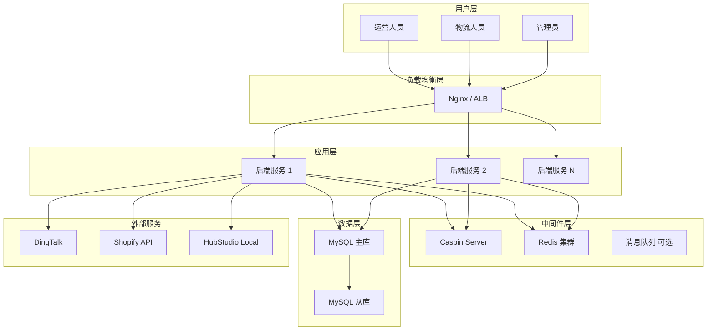

# 技术方案设计 - 跨境电商业务中台

> 基于 PRD V1.1 的详细技术实现方案  
> **状态**: 待技术团队填充完善

---

## 1. 技术选型详细评估

### 1.1 后端框架选型

#### 方案对比

| 框架 | 优势 | 劣势 | 适配度 | 推荐指数 |
|:---|:---|:---|:---|:---:|
| **FastAPI (Python)** | - 高性能异步支持<br>- 自动生成 API 文档<br>- 类型提示友好<br>- 学习曲线平缓 | - 生态相对 Spring 小<br>- 大型项目需谨慎设计 | ⭐⭐⭐⭐ | ★★★★☆ |
| **Spring Boot (Java)** | - 企业级成熟度高<br>- 生态完善<br>- 性能优秀<br>- 团队熟悉度高 | - 启动速度较慢<br>- 配置相对复杂 | ⭐⭐⭐⭐⭐ | ★★★★★ |
| **Django (Python)** | - ORM 强大<br>- Admin 后台开箱即用 | - 同步框架性能一般<br>- 过于重型 | ⭐⭐⭐ | ★★★☆☆ |

**最终选型**: _待技术团队决策_

**选型建议**:
- 如团队 Java 经验丰富，推荐 **Spring Boot**
- 如追求快速开发和现代化技术栈，推荐 **FastAPI**

---

### 1.2 前端框架选型

#### 方案对比

| 框架 | 优势 | 劣势 | UI 组件库 | 推荐指数 |
|:---|:---|:---|:---|:---:|
| **Vue 3 + Ant Design Vue** | - 渐进式，易上手<br>- Composition API 灵活<br>- 中文文档完善 | - 大型项目需要规范 | Ant Design Vue | ★★★★★ |
| **React + Ant Design Pro** | - 生态最丰富<br>- 企业级方案成熟 | - 学习曲线陡峭 | Ant Design | ★★★★☆ |
| **Next.js** | - SSR 支持<br>- SEO 友好 | - 中台场景不需要 SSR | - | ★★★☆☆ |

**最终选型**: _待技术团队决策_

**选型建议**: 推荐 **Vue 3 + Ant Design Vue**（平衡开发效率和团队技能）

---

### 1.3 Casbin 部署方式

#### 方案对比

| 方案 | 说明 | 优势 | 劣势 | 推荐场景 |
|:---|:---|:---|:---|:---|
| **Casbin Server (独立服务)** | Go/Rust 实现的 gRPC 服务 | - 性能极高<br>- 中心化管理<br>- 跨语言支持 | - 需要额外维护 | 多服务共享权限 |
| **Casbin SDK (内嵌)** | 在业务服务中直接集成 | - 部署简单<br>- 延迟最低 | - 策略分散<br>- 难以统一管理 | 单体应用 |

**最终选型**: **Casbin Server (独立服务)** ✅

**理由**: 中台需要为多个服务提供统一鉴权，独立部署便于扩展和管理。

---

## 2. 数据库设计详细方案

### 2.1 主库表结构（MySQL）

#### 完整字段设计

**users 表**
```sql
CREATE TABLE `users` (
  `id` INT UNSIGNED AUTO_INCREMENT PRIMARY KEY,
  `dingtalk_id` VARCHAR(100) NOT NULL UNIQUE COMMENT '钉钉 User ID',
  `username` VARCHAR(50) NOT NULL COMMENT '用户名',
  `display_name` VARCHAR(100) COMMENT '显示名称',
  `email` VARCHAR(100) COMMENT '邮箱',
  `phone` VARCHAR(20) COMMENT '手机号',
  `avatar_url` VARCHAR(255) COMMENT '头像 URL',
  `hubstudio_user_id` VARCHAR(100) COMMENT 'HubStudio 用户 ID',
  `department` VARCHAR(100) COMMENT '部门',
  `is_active` BOOLEAN DEFAULT TRUE COMMENT '是否启用',
  `last_login_at` TIMESTAMP NULL COMMENT '最后登录时间',
  `last_login_ip` VARCHAR(45) COMMENT '最后登录 IP',
  `created_at` TIMESTAMP DEFAULT CURRENT_TIMESTAMP,
  `updated_at` TIMESTAMP DEFAULT CURRENT_TIMESTAMP ON UPDATE CURRENT_TIMESTAMP,
  INDEX `idx_dingtalk_id` (`dingtalk_id`),
  INDEX `idx_is_active` (`is_active`)
) ENGINE=InnoDB DEFAULT CHARSET=utf8mb4 COMMENT='用户表';
```

**shops 表**
```sql
CREATE TABLE `shops` (
  `id` INT UNSIGNED AUTO_INCREMENT PRIMARY KEY,
  `shop_name` VARCHAR(100) NOT NULL COMMENT '店铺名称',
  `shop_domain` VARCHAR(200) NOT NULL UNIQUE COMMENT 'Shopify 域名',
  `access_token` VARCHAR(255) NOT NULL COMMENT 'API Token (加密存储)',
  `shopify_shop_id` BIGINT COMMENT 'Shopify Shop ID',
  `hubstudio_env_id` VARCHAR(100) COMMENT 'HubStudio 环境 ID',
  `hubstudio_env_name` VARCHAR(100) COMMENT 'HubStudio 环境名称',
  `risk_level` ENUM('low', 'medium', 'high') DEFAULT 'low' COMMENT '风控等级',
  `currency` VARCHAR(3) DEFAULT 'USD' COMMENT '货币',
  `timezone` VARCHAR(50) COMMENT '时区',
  `is_active` BOOLEAN DEFAULT TRUE COMMENT '是否启用',
  `webhook_verified_at` TIMESTAMP NULL COMMENT 'Webhook 验证时间',
  `created_by` INT UNSIGNED COMMENT '创建人 ID',
  `created_at` TIMESTAMP DEFAULT CURRENT_TIMESTAMP,
  `updated_at` TIMESTAMP DEFAULT CURRENT_TIMESTAMP ON UPDATE CURRENT_TIMESTAMP,
  INDEX `idx_shop_domain` (`shop_domain`),
  INDEX `idx_is_active` (`is_active`),
  INDEX `idx_risk_level` (`risk_level`)
) ENGINE=InnoDB DEFAULT CHARSET=utf8mb4 COMMENT='店铺表';
```

**products 表**
```sql
CREATE TABLE `products` (
  `id` BIGINT UNSIGNED AUTO_INCREMENT PRIMARY KEY,
  `sku` VARCHAR(50) NOT NULL UNIQUE COMMENT 'SKU 编码',
  `title_cn` VARCHAR(200) COMMENT '中文标题',
  `title_en` VARCHAR(200) COMMENT '英文标题',
  `description_cn` TEXT COMMENT '中文描述',
  `description_en` TEXT COMMENT '英文描述',
  `purchase_url` TEXT COMMENT '采购链接',
  `reference_url` TEXT COMMENT '参考竞品 URL',
  `template_id` INT UNSIGNED COMMENT '关联模板 ID',
  `category_id` INT UNSIGNED COMMENT '分类 ID',
  `cost_price` DECIMAL(10,2) COMMENT '成本价',
  `suggested_price` DECIMAL(10,2) COMMENT '建议售价',
  `weight` DECIMAL(8,2) COMMENT '重量(kg)',
  `status` ENUM('draft', 'active', 'archived') DEFAULT 'draft' COMMENT '状态',
  `main_image_url` VARCHAR(255) COMMENT '主图 URL',
  `created_by` INT UNSIGNED COMMENT '创建人 ID',
  `created_at` TIMESTAMP DEFAULT CURRENT_TIMESTAMP,
  `updated_at` TIMESTAMP DEFAULT CURRENT_TIMESTAMP ON UPDATE CURRENT_TIMESTAMP,
  INDEX `idx_sku` (`sku`),
  INDEX `idx_status` (`status`),
  INDEX `idx_category_id` (`category_id`),
  INDEX `idx_created_by` (`created_by`)
) ENGINE=InnoDB DEFAULT CHARSET=utf8mb4 COMMENT='产品表';
```

**orders 表**
```sql
CREATE TABLE `orders` (
  `id` BIGINT UNSIGNED AUTO_INCREMENT PRIMARY KEY,
  `shopify_order_id` VARCHAR(100) NOT NULL UNIQUE COMMENT 'Shopify 订单号',
  `order_number` VARCHAR(50) COMMENT 'Shopify 订单编号(#1001)',
  `shop_id` INT UNSIGNED NOT NULL COMMENT '店铺 ID',
  `customer_email` VARCHAR(100) COMMENT '客户邮箱',
  `customer_name` VARCHAR(100) COMMENT '客户姓名',
  `shipping_address` JSON COMMENT '收货地址 JSON',
  `total_amount` DECIMAL(10,2) NOT NULL COMMENT '订单金额',
  `currency` VARCHAR(3) DEFAULT 'USD' COMMENT '货币',
  `tracking_number` VARCHAR(100) COMMENT '物流单号',
  `tracking_company` VARCHAR(50) COMMENT '物流公司',
  `status` ENUM('pending', 'paid', 'shipped', 'delivered', 'cancelled') DEFAULT 'pending',
  `fulfillment_status` ENUM('unfulfilled', 'partial', 'fulfilled') DEFAULT 'unfulfilled',
  `payment_status` ENUM('pending', 'paid', 'refunded') DEFAULT 'pending',
  `shopify_created_at` TIMESTAMP COMMENT 'Shopify 订单创建时间',
  `fulfilled_at` TIMESTAMP NULL COMMENT '发货时间',
  `synced_at` TIMESTAMP DEFAULT CURRENT_TIMESTAMP COMMENT '同步到中台时间',
  `created_at` TIMESTAMP DEFAULT CURRENT_TIMESTAMP,
  `updated_at` TIMESTAMP DEFAULT CURRENT_TIMESTAMP ON UPDATE CURRENT_TIMESTAMP,
  INDEX `idx_shopify_order_id` (`shopify_order_id`),
  INDEX `idx_shop_id` (`shop_id`),
  INDEX `idx_status` (`status`),
  INDEX `idx_tracking_number` (`tracking_number`),
  INDEX `idx_shopify_created_at` (`shopify_created_at`),
  FOREIGN KEY (`shop_id`) REFERENCES `shops`(`id`)
) ENGINE=InnoDB DEFAULT CHARSET=utf8mb4 COMMENT='订单表';
```

_（其他表结构待补充）_

---

### 2.2 索引优化策略

#### 关键查询场景索引设计

| 查询场景 | 索引设计 | 说明 |
|:---|:---|:---|
| **订单列表分页** | `(shop_id, shopify_created_at DESC)` | 复合索引，覆盖常用筛选 |
| **产品搜索** | `FULLTEXT(title_en, title_cn)` | 全文索引支持模糊搜索 |
| **权限检查** | `(dingtalk_id, is_active)` | 快速验证用户状态 |
| **订单同步幂等性** | `UNIQUE(shopify_order_id)` | 防止重复插入 |

_待补充更多索引设计_

---

### 2.3 分库分表策略（可选）

**当前阶段**: 单库单表  
**触发条件**: 订单表超过 1000 万条记录

**分表策略**:
```
orders_2024_q1
orders_2024_q2
orders_2024_q3
...
```

**分表键**: `shopify_created_at` 按季度分表

---

## 3. API 接口设计

### 3.1 RESTful API 规范

#### 统一响应格式
```json
{
  "code": 200,
  "message": "Success",
  "data": { ... },
  "timestamp": 1733637600
}
```

#### 错误响应格式
```json
{
  "code": 400,
  "message": "Invalid request",
  "errors": [
    {
      "field": "email",
      "message": "Email format is invalid"
    }
  ],
  "timestamp": 1733637600
}
```

#### 分页参数
```
GET /api/products?page=1&page_size=20&sort=-created_at
```

---

### 3.2 核心接口设计

#### 产品刊登接口
```yaml
POST /api/products/{id}/publish
Request:
  {
    "shop_ids": [1, 2, 3],       # 目标店铺 ID 列表
    "template_id": 5,             # 模板 ID
    "price_multiplier": 1.5       # 价格倍数（可选）
  }
Response:
  {
    "code": 200,
    "data": {
      "results": [
        {
          "shop_id": 1,
          "shop_name": "Store A",
          "success": true,
          "shopify_product_id": "7891234567890",
          "product_url": "https://store-a.myshopify.com/products/xxx"
        },
        {
          "shop_id": 2,
          "shop_name": "Store B",
          "success": false,
          "error": "Rate limit exceeded"
        }
      ]
    }
  }
```

#### 订单物流回传接口
```yaml
POST /api/orders/{id}/fulfill
Request:
  {
    "tracking_number": "YT9876543210",
    "tracking_company": "YunExpress",
    "use_hubstudio": true,        # 是否使用 HubStudio 环境
    "notify_customer": true       # 是否通知客户
  }
Response:
  {
    "code": 200,
    "data": {
      "fulfillment_id": "123456",
      "status": "success",
      "tracking_url": "https://track.yunexpress.com/YT9876543210"
    }
  }
```

_待补充其他接口设计_

---

## 4. 部署架构设计

### 4.1 部署架构图



### 4.2 服务器资源规划

| 环境 | 服务 | 配置 | 数量 | 说明 |
|:---|:---|:---|:---:|:---|
| **生产环境** | 后端服务 | 4C8G | 2 | 负载均衡 |
| | Casbin Server | 2C4G | 1 | 独立部署 |
| | MySQL 主库 | 8C16G | 1 | 数据持久化 |
| | MySQL 从库 | 8C16G | 1 | 读写分离 |
| | Redis 集群 | 4C8G | 3 | 高可用 |
| | Nginx | 2C4G | 1 | 负载均衡 |
| **测试环境** | All-in-One | 8C16G | 1 | 单机部署 |

_待技术团队根据预算调整_

---

## 5. 性能优化方案

### 5.1 缓存策略

| 数据类型 | 缓存位置 | TTL | 淘汰策略 | 说明 |
|:---|:---|:---|:---|:---|
| **用户权限** | Redis | 1小时 | LRU | 降低 Casbin 查询频率 |
| **店铺配置** | Redis | 30分钟 | LRU | 减少数据库查询 |
| **产品详情** | Redis | 10分钟 | LRU | 高频访问数据 |
| **产品列表** | Redis | 5分钟 | LRU | 带分页信息 |

### 5.2 数据库优化

- [ ] 使用连接池（HikariCP / SQLAlchemy Pool）
- [ ] 慢查询监控（< 100ms）
- [ ] 分页查询使用游标而非 OFFSET
- [ ] 避免 SELECT *，明确字段
- [ ] 批量操作使用 Batch Insert

### 5.3 API 优化

- [ ] 实施 CDN 加速静态资源
- [ ] 开启 Gzip 压缩
- [ ] 使用 HTTP/2
- [ ] 实施接口限流（Nginx limit_req）

_待补充具体配置_

---

## 6. 安全加固方案

### 6.1 数据加密实施

#### 敏感数据加密
```python
# 示例：使用 AES-256 加密 Shopify Token
from cryptography.fernet import Fernet

# 生成密钥（存储在环境变量）
key = Fernet.generate_key()
cipher = Fernet(key)

# 加密
encrypted_token = cipher.encrypt(b"shpat_xxxxx")

# 解密
decrypted_token = cipher.decrypt(encrypted_token)
```

#### 数据库字段加密
- `shops.access_token`: AES-256 加密
- `users.phone`: 可选脱敏/部分加密
- `finance_records.*`: 列级加密

### 6.2 API 安全

- [ ] 所有生产环境强制 HTTPS
- [ ] JWT Token 有效期设置为 2 小时
- [ ] 实施 CORS 白名单
- [ ] 添加 CSRF Token 保护
- [ ] 实施 SQL 注入防护（ORM 参数化）
- [ ] 实施 XSS 防护（输入过滤）

_待补充具体实现_

---

## 7. 测试策略

### 7.1 测试金字塔

| 测试类型 | 占比 | 目标覆盖率 | 工具 |
|:---|:---:|:---:|:---|
| **单元测试** | 70% | > 80% | pytest / JUnit |
| **集成测试** | 20% | > 60% | pytest / Spring Test |
| **端到端测试** | 10% | > 40% | Selenium / Playwright |

### 7.2 关键测试场景

#### 单元测试
- [ ] Casbin 权限验证逻辑
- [ ] 订单幂等性校验
- [ ] 加密/解密函数
- [ ] 工具类函数

#### 集成测试
- [ ] DingTalk 登录流程
- [ ] Shopify API 调用（Mock）
- [ ] 数据库操作
- [ ] Redis 缓存读写

#### 端到端测试
- [ ] 完整产品刊登流程
- [ ] 完整订单处理流程
- [ ] 权限控制验证

_待编写具体测试用例_

---

## 8. 监控与日志

### 8.1 监控指标

#### 应用监控（APM）
- [ ] 接口响应时间（P50/P90/P99）
- [ ] 错误率
- [ ] QPS/TPS
- [ ] 慢查询统计

**推荐工具**: _Grafana + Prometheus / New Relic / Datadog_

#### 业务监控
- [ ] 每日订单同步数量
- [ ] 刊登成功率
- [ ] 用户活跃度（DAU/MAU）
- [ ] API 调用量（Shopify/HubStudio）

### 8.2 日志规范

#### 日志级别
```
ERROR: 系统错误，需要立即处理
WARN:  潜在问题，需要关注
INFO:  关键业务操作（登录、刊登、订单同步）
DEBUG: 调试信息（仅开发环境）
```

#### 日志格式（JSON）
```json
{
  "timestamp": "2025-12-08T15:00:00+08:00",
  "level": "INFO",
  "service": "emp-backend",
  "trace_id": "abc123",
  "user_id": 123,
  "message": "Product published successfully",
  "context": {
    "product_id": 456,
    "shop_id": 1
  }
}
```

_待配置日志收集（ELK / Loki）_

---

## 9. 上线方案

### 9.1 灰度发布策略

| 阶段 | 用户占比 | 持续时间 | 验收标准 |
|:---|:---:|:---:|:---|
| **Alpha** | 内部测试（5人） | 1周 | 核心功能可用，无阻塞性 Bug |
| **Beta 1** | 10% 用户 | 3天 | 错误率 < 2%，无严重问题反馈 |
| **Beta 2** | 50% 用户 | 3天 | 性能指标达标，用户反馈正面 |
| **全量** | 100% 用户 | - | 正式上线 |

### 9.2 回滚方案

#### 回滚触发条件
- 错误率 > 5%
- 系统可用性 < 95%
- 出现数据丢失
- 关键功能无法使用

#### 回滚步骤
```bash
# 1. 停止新版本服务
systemctl stop emp-backend-v2

# 2. 切换流量到旧版本
nginx -s reload

# 3. 恢复数据库（如有变更）
mysql -u root -p emp_db < backup_before_upgrade.sql

# 4. 验证回滚成功
curl http://api.example.com/health
```

_待编写详细 Runbook_

---

## 10. 待办事项清单

### 高优先级
- [ ] 确定最终技术栈（后端/前端框架）
- [ ] 完善所有数据库表结构
- [ ] 完成 API 接口详细设计（Swagger）
- [ ] 搭建开发环境
- [ ] 配置 CI/CD 流水线

### 中优先级
- [ ] 编写单元测试框架
- [ ] 配置监控告警
- [ ] 准备测试数据
- [ ] 编写部署文档

### 低优先级
- [ ] 性能优化方案细化
- [ ] 灾备演练计划
- [ ] 技术分享与培训

---

**文档版本**: V1.0  
**对应 PRD 版本**: V1.1  
**负责人**: _待指定_  
**评审状态**: 待评审
